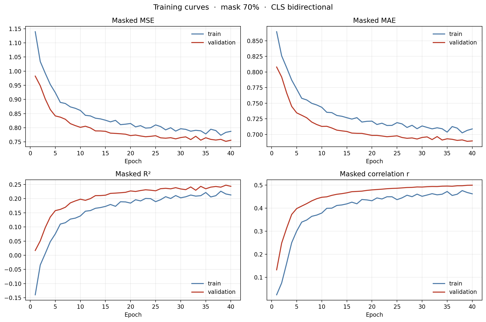
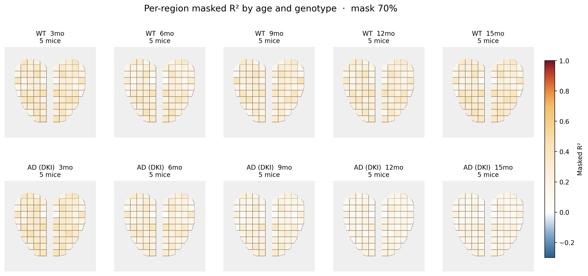
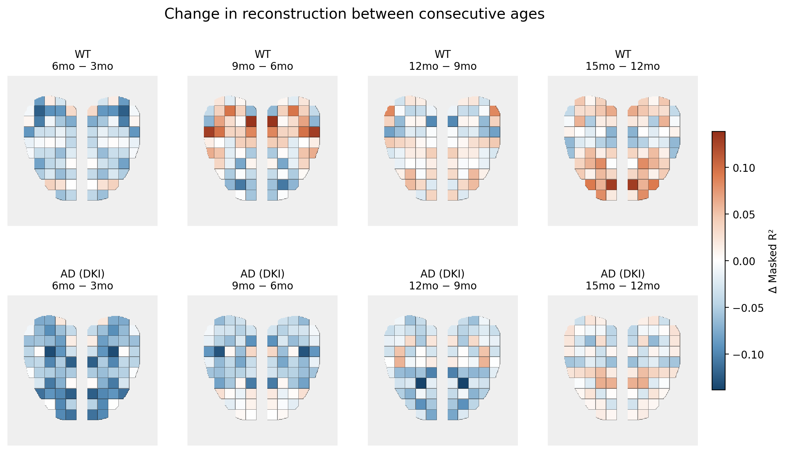
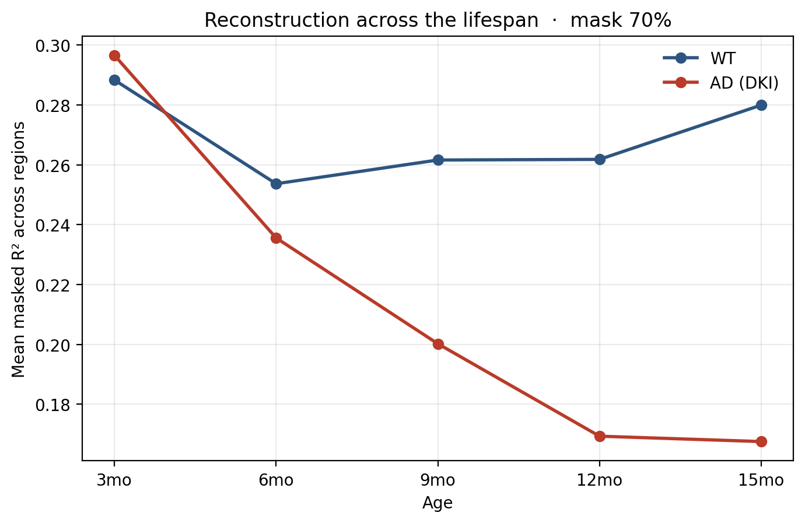
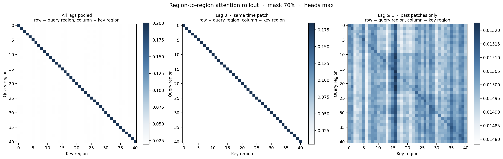

# STAMP: Spatio-Temporal ACh Masked Pretraining

STAMP is a **self-supervised transformer** that learns the spatio-temporal structure of cortical **acetylcholine (ACh)** signalling from widefield calcium imaging, and then reports **which cortical regions become less predictable with age in a mouse model of Alzheimer's disease**.

The model is trained by **masked reconstruction under block-causal attention**: 70% of the (region × time) cells in a 15-second window are hidden, and the model must restore them using only the other regions at the same instant and every region at earlier instants. It never sees the future. Nothing about age or genotype is used during training — those labels appear only in the analysis, so any group difference the model reports comes from the structure of the signal itself.

---

## Overview

Widefield imaging of a cholinergic sensor covers the whole dorsal cortex at 10 Hz. The imaging field is divided into a **grid parcellation of 82 cortical parcels**, 41 anatomical areas, each appearing once in the left and once in the right hemisphere. Because the two hemispheres of an area are bilateral homologues, adjacent channel pairs `(1,2), (3,4) … (81,82)` are averaged together, leaving **41 bilateral regions**. Recordings come from wild-type mice and from a knock-in AD model (DKI) at **3, 6, 9, 12 and 15 months**.

The question is whether the **spatio-temporal structure** of cortical acetylcholine signalling is disrupted in the AD model — which regions predict which, and whether that coupling breaks down progressively with age. 

Answering it means measuring those inter-regional relationships directly, which is exactly what STAMP's attention mechanism computes: for every region at every moment, it learns a directed, content-dependent weight to every other region at every earlier moment. STAMP further turns this into a number — a region's reconstruction R² stays high while it is coupled to the rest of the cortex and falls as it decouples — and running the same model at 3, 6, 9, 12 and 15 months turns that into a trajectory, so the two genotypes can be compared on **when** they diverge, not only where they end up.

Two read-outs come out of a trained model:

| Read-out | What it measures | Where it comes from |
|---|---|---|
| **Per-region masked R²** | how predictable each region is from the rest of the cortex | `analyze.py` → brain maps, age × genotype panels |
| **Attention rollout** | where the model actually looks, split by spatial vs temporal distance | `analyze.py` → region × region and region × time maps |

> **⚠️ The recordings this project was built on are unpublished and are not distributed here.**
> `scripts/make_synthetic_data.py` writes a file with an identical structure filled with **simulated** signals so that the entire pipeline can be run end to end by anyone. Results obtained from it are meaningless biologically; it exists to exercise the code.

---

## Data Format

Input is a single HDF5 file. `data/loading.py` reads exactly this layout, and `scripts/make_synthetic_data.py` writes exactly this layout, so the generator doubles as the executable specification.

```
<dataset>.h5
├── session_index/                       # one entry per recording session
│   ├── session_key : (S,) string        # name of the group holding that session
│   ├── age         : (S,) string        # '3mo' | '6mo' | '9mo' | '12mo' | '15mo'
│   ├── genotype    : (S,) string        # 'wt' | 'mt'   ('dki' is accepted, mapped to 'mt')
│   ├── mouse       : (S,) string        # physical mouse ID, e.g. 'WT03'
│   └── region_name : (82,) string       # optional, raw channel names
│
└── <session_key>/                       # one group per session, named by session_key
    ├── ACh            : (T, 82) float   # raw cholinergic traces, 10 Hz
    │                                    #   either orientation is accepted
    │                                    #   'green', 'ach_trace' also recognised
    └── ml_valid_frame : (T,) bool       # optional QC mask, 1 = usable frame
```

### Key points

- **Channels are interleaved by hemisphere**: `(left_0, right_0, left_1, right_1, ...)`. Adjacent pairs `(1,2), (3,4) … (81,82)` in one-based indexing are averaged into one bilateral region, giving **41 regions**.
- **`mouse` is the physical animal**, not the session. One mouse contributes sessions at several ages, and every one of them stays on the same side of the train/validation split. This is the single most important correctness detail in the repository.
- **Missing values are handled, not assumed away.** A window is kept only if every one of its 150 frames passes `ml_valid_frame` *and* is finite after hemisphere averaging.
- **Normalization is per window, per region.** Each region is z-scored within its own window, so an R² of 0 means exactly "no better than predicting the window mean", and every region is on the same scale.

### Common format errors and fixes

| Error | Cause | Fix |
|---|---|---|
| `session_index group is missing` | file is not in STAMP format | run `scripts/make_synthetic_data.py` and compare, or build the index group shown above |
| `session_index is missing fields: [...]` | index group incomplete | all four of `session_key`, `age`, `genotype`, `mouse` are required |
| `Cannot uniquely locate the ACh trace` | trace named something unrecognised | name it `ACh`, or include `ach`/`green` in the name |
| `Unexpected ACh shape` | not 2-D, or neither axis is 82 | reshape to `(T, 82)` or `(82, T)` |
| `No usable ACh sessions found` | every age or genotype value was rejected | ages must be one of `3mo 6mo 9mo 12mo 15mo`; genotype must be `wt`, `mt` or `dki` |
| `No complete valid windows found` | QC rejected everything | check `ml_valid_frame` is 1 for usable frames, not 0 |

---

## Quick Start

Four commands, no data required, about ten minutes on a laptop.

### 1. Install

```bash
git clone https://github.com/<sophia-abudukelimu>/stamp.git
cd stamp
pip install -r requirements.txt
```

### 2. Generate a synthetic dataset

```bash
python scripts/make_synthetic_data.py --out synthetic_ach.h5
```

This writes ~46 MB: 10 mice (5 WT, 5 AD), five ages, five minutes of simulated recording per session, plus `synthetic_grid.npz`, a cartoon parcellation so the brain maps render. Add `--small` for a 4 MB smoke-test version.

### 3. Train

```bash
python train.py --data synthetic_ach.h5 --out runs/demo --epochs 30
```

Add `--cpu` if no GPU is available. Every artifact is written to `runs/demo/` as it is produced — the history CSV is rewritten every epoch — so an interrupted run still leaves usable results.

### 4. Analyze

```bash
python analyze.py --run runs/demo --grid synthetic_grid.npz
```

Reads only what `train.py` wrote, so it runs later, elsewhere, without a GPU, and without the original `.h5`. Figures land in `runs/demo/figures/`.

To run on real recordings, point `--data` at your own file in the format above and `--grid` at the MATLAB parcellation (`grid.mat`).

### What you should see

Running the four commands above on the synthetic dataset (10 mice, 799 valid windows, 40 epochs, CPU) gives:

```
Zero-prediction baseline MSE   0.9994     must be near 1.0 on z-scored windows
Validation R²                  0.2435
train − validation R²         -0.0306     negative and flat: no overfitting
Off-diagonal rollout mass, lag 0      50.8%
Off-diagonal rollout mass, lag >= 1   97.5%
Causal leak ratio (trained)           14.2%
```

Each number is the **mean masked R² across all 41 regions** for that age × genotype group, evaluated at 70% masking. R² = 1 is perfect reconstruction; **R² = 0 means no better than predicting the window mean**, so it is the floor. The last column is the genotype gap: negative means the AD group is *less* reconstructable than WT at that age.

| Age | WT<br>mean R² | AD (DKI)<br>mean R² | AD − WT<br>gap |
|---|---|---|---|
| 3mo | 0.288 | 0.297 | +0.008 |
| 6mo | 0.254 | 0.236 | −0.018 |
| 9mo | 0.262 | 0.200 | −0.061 |
| 12mo | 0.262 | 0.169 | −0.093 |
| 15mo | 0.280 | 0.168 | **−0.113** |


The generator was built so that WT stays flat while AD decouples progressively after 3 months, and the pipeline recovers that: the two genotypes are indistinguishable at 3 months and separate steadily thereafter. **This is a property of the simulator, not a finding** — it is here to show what a positive result looks like when the pipeline is working.

The absolute R² is modest because the demo trains on 799 windows; the real dataset has roughly 70× more and reaches substantially higher. Pass `--epochs 60` and a larger `--frames-per-session` to the generator if you want the demo closer to a real run.

---

## Model

Each session is a continuous recording, far longer than the model's input. It is cut into **non-overlapping 15-second windows** of 150 frames at 10 Hz; on the real dataset this yields 70,235 usable windows from 208 sessions. Each window is z-scored per region, so every window is independent and every region is on the same scale.

One window is then cut a second time, along both axes. The 15 seconds are split into **10 time patches of 1.5 s (15 frames each)**, and that cut is crossed with the 41 regions, giving a grid of **41 regions × 10 time patches = 410 cells**. Each cell becomes one token holding 1.5 s of one region, and a CLS token is prepended, for a sequence of 411.

| Stage | Operation | Output shape |
|---|---|---|
| Input | z-scored window | `(B, 150, 41)` |
| Patchify | split time into 10 patches, time-major | `(B, 410, 15)` |
| Token projection | `Linear(15 → 128)`, shared by all tokens | `(B, 410, 128)` |
| Masking | 287 of 410 cells replaced by `mask_token` | `(B, 410, 128)` |
| Position | + region embedding `(41, 128)` + time embedding `(10, 128)` | `(B, 410, 128)` |
| Prepend CLS | | `(B, 411, 128)` |
| Encoder ×2 | pre-norm, 4 heads, block-causal mask | `(B, 411, 128)` |
| Split | CLS / tokens | `(B, 128)` + `(B, 410, 128)` |
| Decoder | `Linear(128 → 15)`, scored on masked cells only | `(B, 410, 15)` |
| Projection head | on CLS, for VICReg | `(B, 128)` |

**243,343 parameters.**

### Block-causal attention

Token order is **time-major**, `token = patch × 41 + region`, which turns the attention mask into a clean staircase of 41×41 blocks:

```
             key patch  →
             CLS t0 t1 t2 t3 t4 t5 t6 t7 t8 t9
       CLS  [ ■  ■  ■  ■  ■  ■  ■  ■  ■  ■  ■ ]   CLS reads everything
 q      t0  [ ■  ■  ·  ·  ·  ·  ·  ·  ·  ·  · ]
 u      t1  [ ■  ■  ■  ·  ·  ·  ·  ·  ·  ·  · ]
 e      t2  [ ■  ■  ■  ■  ·  ·  ·  ·  ·  ·  · ]   ■ = allowed
 r      ..  [ ■  ■  ■  ■  ■  ·  ·  ·  ·  ·  · ]   · = blocked
 y      t9  [ ■  ■  ■  ■  ■  ■  ■  ■  ■  ■  ■ ]
```

Within a block, all 41 regions of one moment are fully connected. Across blocks, a query reaches every earlier patch and no later one. **55% of the 411 × 411 matrix is allowed.**

The mask is applied **before the softmax** by filling blocked scores with `-inf`. Applying it after the softmax without renormalizing would leak the future through the denominator; applying it after with renormalization is mathematically identical but cannot use the fused kernel. Both alternatives are implemented in `models/transformer.py` so the failure mode can be demonstrated rather than argued about.

### The CLS trade-off, measured rather than assumed

The CLS embedding is what downstream analysis extracts, so it needs a real training signal. But the reconstruction decoder reads token positions only. If no token can read CLS (`CLS_MODE = "sink"`, strictly causal), then **`cls_token` receives exactly zero gradient from the reconstruction loss** and learns from the VICReg term alone, at weight 0.05.

Opening the CLS column (`CLS_MODE = "bidirectional"`, the default) fixes that, at a price: with two layers it creates the two-hop path `past token → CLS → future token`, so the model is no longer strictly causal. Direct attention from a past query to a future key is still blocked — the leak is indirect and has to squeeze through one shared 128-dimensional vector.

Both effects are measured, at initialization and again on the trained checkpoint:

| `CLS_MODE` | CLS gradient from MSE | Leak at init | Leak after training | Rollout mass on future keys |
|---|---|---|---|---|
| `sink` | `0.000e+00` | `0.000%` (exactly) | `0.000%` (asserted) | 0.000% |
| `bidirectional` | `4.99e-01` | 1.2% | **14.2%** | 0.29% |

"Leak" is how far the reconstruction of patches 0–5 moves when patches 6–9 are perturbed, as a fraction of how far the perturbed patches themselves move.

The jump from 1.2% to 14.2% is the part worth taking seriously: **gradient descent actively seeks this channel out.** The number at initialization is whatever random weights happen to pass through and is not a useful estimate of the trained model. `train.py` therefore measures it again on the selected checkpoint and writes it to `causal_leak.csv`, so the figure quoted in a talk is the one that was actually trained, not the one that was hoped for.

`train.py` refuses to finish a `sink` run whose past moved at all. Switch with `--cls-mode sink` to reproduce the strictly causal variant and compare the two R² values: the difference is a direct estimate of how much the future is worth.

### Loss

```
total = ½ · [ MSE(view 1) + MSE(view 2) ]  +  0.05 · VICReg(CLS₁, CLS₂)
```

Two independent mask draws of the same window give two views. The MSE is scored **only on masked cells**. VICReg (invariance 25, variance 25, covariance 1) is applied to the projected CLS embeddings of the two views, which keeps the representation from collapsing without needing negative pairs.

---

## Analysis

`analyze.py` produces eleven figures. What each one is for:

### Reconstruction quality

| Figure | What it shows |
|---|---|
| `training_curves.png` | MSE, MAE, R² and correlation over training, train against validation |
| `overfitting_check.png` | train R² minus validation R². It sits **below** zero because dropout is on during training and off during validation; positive and growing would mean memorization |
| `region_r2_bars.png` | the 41 regions ranked from hardest to easiest to reconstruct |
| `brain_r2_all.png` | the same values painted on the cortex |



*Four panels over 40 epochs, train against validation: masked MSE, masked MAE, masked R², and correlation. MSE falls from 1.14 to 0.78 while the zero-prediction baseline sits at 1.00, so the model is genuinely reconstructing rather than predicting the window mean. Validation tracks train throughout. Synthetic data.*

### Age and genotype

| Figure | What it shows |
|---|---|
| `brain_r2_by_age_genotype.png` | a 2 × 5 grid: WT above, AD below, 3 to 15 months left to right |
| `brain_r2_age_differences.png` | consecutive ages within genotype, `later − earlier` |
| `brain_r2_genotype_difference.png` | **AD − WT**, pooled and per age. Blue means AD is less predictable |
| `r2_trajectories.png` | mean R² against age, one line per genotype |



*Per-region masked R² painted on the cortex, WT above and AD below, 3 to 15 months left to right. White is R² = 0. The AD row fades progressively while the WT row stays flat. Synthetic data.*



*The same result as a difference: each panel is `later age − earlier age` within one genotype, so white means nothing changed between those two timepoints. Subtracting removes the region-to-region baseline — some areas are simply always easier to reconstruct — and leaves only what moved. WT panels stay near white; AD panels go increasingly blue. Synthetic data.*



*Mean per-region R² against age, one line per genotype. The two start together at 3 months and separate steadily after. Synthetic data.*

Colour convention throughout: **white sits exactly at R² = 0**, and the stops are packed between 0.70 and 1.00 where nearly all regions land. Blue means the model does worse than predicting the window mean.

### Attention

| Figure | What it shows |
|---|---|
| `attention_mask_and_rollout.png` | the allowed mask beside the realised rollout, confirming the causal structure survived both layers |
| `region_to_region_rollout.png` | **the important one.** Three panels: all lags, lag 0 only, lag ≥ 1 only |
| `rollout_region_time.png` | how rollout mass is distributed over the ten time patches |
| `brain_attention_rollout.png` | which regions contribute most to the CLS embedding |



*Attention rollout collapsed to region × region, split by temporal lag. Left: all lags pooled. Middle: lag 0, within one 1.5 s patch — almost pure diagonal, so at a single instant each region attends mainly to itself. Right: lag ≥ 1, past patches only — the off-diagonal structure appears here, and only here. Off-diagonal mass is 50.8% at lag 0 against 97.5% at lag ≥ 1. Synthetic data.*

**On reading `region_to_region_rollout.png`:** the middle panel (lag 0) and the right panel (lag ≥ 1) answer different questions. If the off-diagonal structure lives mostly in the right panel, regions relate to each other **across time** rather than within a moment — cortical areas take turns rather than moving together. `analyze.py` prints the off-diagonal mass of each panel so this can be quoted as a number.

**On reading `rollout_region_time.png`:** the peak at `t0` is **structural, not a finding**. Because attention only looks backwards, an early patch is readable by every later query while the last patch is readable only by itself, so early patches accumulate rollout mass from more queries. Only deviations from that baseline are interpretable.
---

## Project Structure

```
stamp/
├── train.py                       # stage 1: train, evaluate, write everything
├── analyze.py                     # stage 2: read a run, produce all figures
├── config.py                      # every constant, with the reasoning
├── requirements.txt
│
├── data/
│   ├── loading.py                 # HDF5 -> hemisphere average -> windows -> z-score
│   └── datasets.py                # physical-mouse split, Dataset, DataLoaders
├── models/
│   └── transformer.py             # block-causal encoder, masking, VICReg, self-checks
├── training/
│   └── loop.py                    # one pass over a loader, train or eval
├── evaluation/
│   ├── metrics.py                 # streaming per-region R2 / MSE / MAE / r
│   ├── rollout.py                 # attention rollout, split by temporal lag
│   └── leak.py                    # how much the CLS wiring costs and buys
├── visualization/
│   ├── palettes.py                # white-at-zero R2 colormap
│   ├── brain_maps.py              # parcellation -> painted cortex
│   └── figures.py                 # every figure, one function each
├── scripts/
│   └── make_synthetic_data.py     # simulated dataset in the exact input format
├── notebooks/                     # the original Colab notebook, for reference
└── docs/figures/                  # figures used in this README
```

### What a run directory contains

```
runs/demo/
├── config.json                        exact configuration used
├── run_log.txt                        everything printed, timestamped
├── session_metadata.csv               one row per session
├── region_labels.json                 the 41 bilateral names
├── window_counts_by_age_genotype.csv
├── split_summary.csv                  mice and windows per side
├── split_mice.json                    which mouse went where
├── model_checks.json                  parameters, fused-vs-explicit, leak at init
├── history.csv                        rewritten EVERY epoch
├── checkpoint.pt                      best validation loss
├── region_metrics.csv                 per-region R2 on validation
├── region_r2_by_age_genotype.csv      per-region R2 for every age x genotype cell
├── causal_leak.csv                    leak measured on the trained model
├── attention_rollout.npz              full rollout, region x region, lag splits
├── region_attention_rollout.csv
└── figures/                           written by analyze.py
```

---

## Key Features

- **Spatio-temporal masking.** Cells are hidden independently across both axes, so a region can be masked at some moments and visible at others. The model cannot solve the task by interpolating one region in time; it has to use its spatial neighbours too.
- **Block-causal attention with a verified mask.** Causality is checked by perturbation, not by reading the code: shift the last four patches and confirm the first six do not move.
- **Split by physical mouse.** A mouse recorded at five ages is one mouse. `GroupShuffleSplit` on `physical_mouse_uid`, with an explicit assertion that the two sets do not intersect.
- **Inverse-frequency sampling.** Windows per mouse are very uneven; each training window is drawn with weight `1 / (windows of that mouse)`, so no animal dominates.
- **Streaming per-region metrics.** Eight running sums per region, float32 elementwise and float64 accumulation. Memory is flat in the number of windows, and the global scalars are literally the per-region arrays summed.
- **A built-in sanity check.** `zero_baseline_mse` should come out at ≈ 1.0 on z-scored windows. If it does not, normalization or masking is wrong and every R² is meaningless. It is printed on every run.
- **Fused attention during training, explicit weights only for rollout.** Roughly a 3× speedup, with the two paths asserted to agree to ~1e-7 relative.
- **Everything written as it is produced.** No result depends on the session surviving to the end.

---

## Installation

```bash
git clone https://github.com/<sophia-abudukelimu>/stamp.git
cd stamp
pip install -r requirements.txt
```

Python 3.9+ and PyTorch 2.0+ (for `scaled_dot_product_attention`). A GPU is strongly recommended for real data; the synthetic demo runs on CPU with `--cpu`.

---

## Configuration

All defaults live in `config.py`, each with the reasoning next to it. The ones most worth changing:

| Setting | Default | Meaning |
|---|---|---|
| `WINDOW_SIZE` | 150 | frames per window (15 s at 10 Hz) |
| `PATCH_LENGTH` | 15 | frames per token (1.5 s) |
| `MASK_RATIO` | 0.70 | fraction of the 410 cells hidden |
| `CLS_MODE` | `bidirectional` | `sink` for strict causality, at the cost of CLS gradient |
| `D_MODEL` / `NHEAD` / `NUM_LAYERS` | 128 / 4 / 2 | encoder size |
| `VICREG_WEIGHT` | 0.05 | weight of the representation term |
| `VALIDATION_FRACTION` | 0.20 | fraction of **mice**, not windows |
| `ROLLOUT_HEAD_REDUCTION` | `max` | heads collapsed with max, never mean |

Command-line flags on `train.py` override them.

---

## Citation

```bibtex
@misc{abudukelimu2026stamp,
  title  = {STAMP: Spatio-Temporal ACh Masked Pretraining for cortical
            cholinergic dynamics across the lifespan},
  author = {Abudukelimu, Sophia},
  year   = {2026},
  note   = {Manuscript in preparation},
  url    = {https://github.com/<sophia-abudukelimu>/stamp}
}
```

## License

[Add your license here — ask your PI first. MIT and BSD-3-Clause are the usual choices for lab code.]

## Contact

Open an issue on GitHub, or email <sophia.abudukelimu@yale.edu>.
